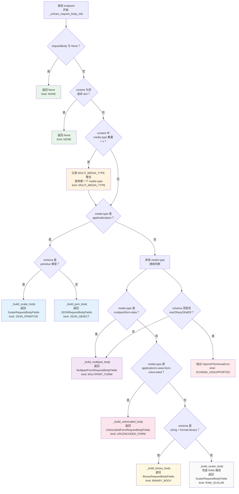

# 请求体渲染规则

本文档描述 `stoma make` 生成 route 文件时，如何根据 OpenAPI 请求体的不同形态选择对应的渲染分支。核心逻辑集中在 `EndpointRenderer._extract_request_body_info`（`src/stoma/openapi/renderer.py` 第 252-362 行）。

## 7 种渲染分支

`_extract_request_body_info` 按严格顺序执行 7 步检查，每步对应一种请求体形态。

### （1）无 requestBody

endpoint 未声明 `requestBody` 字段，或 `requestBody` 为空。函数直接返回 `None`，模板中所有请求体相关代码块均跳过。

**典型场景**：GET、DELETE 等不需要请求体的操作。

**引用**：`src/stoma/openapi/renderer.py` 第 295-296 行。

---

### （2）`application/json` + object schema

`content` 中唯一 media type 为 JSON 类型，且 schema 不是 primitive。渲染器调用 `_build_json_body`（`renderer.py` 第 364-395 行），根据 schema 来源分为两种子路径：

- **$ref schema**：取 ref 末段 PascalCase 化为 model 名，用于 `from .models import BookRequest`。
- **inline object schema**：model 名为 `{PascalOpId}Request`，由 dmcg 前置阶段生成。

**示例 schema 片段**：

```yaml
requestBody:
  content:
    application/json:
      schema:
        $ref: "#/components/schemas/CreateBookRequest"
```

**引用**：`src/stoma/openapi/renderer.py` 第 334、第 364-395 行。

---

### （3）`application/json` + primitive schema

`content` 中唯一 media type 为 JSON 类型，但 schema 是 primitive 类型（`string`、`integer`、`number`、`boolean`）。渲染器调用 `_build_scalar_body`（`renderer.py` 第 539-581 行），生成形如 `body: Annotated[str, Body(media_type="application/json")]` 的字段声明，`media_type` 嵌入 `Body()` 由 client 派生 Content-Type。

**示例 schema 片段**：

```yaml
requestBody:
  content:
    application/json:
      schema:
        type: string
        description: 书名
        example: "The Go Programming Language"
```

**引用**：`src/stoma/openapi/renderer.py` 第 335-336、第 539-581 行。

---

### （4）`multipart/form-data`

media type 为 `multipart/form-data`，且 schema 顶层不含 `oneOf`/`anyOf`/`allOf`。渲染器调用 `_build_multipart_body`（`renderer.py` 第 454-510 行），遍历 `properties`：

- `format == "binary"` 的字段生成 `form_file_fields: list[FieldDecl]`，Playwright 自动处理 Content-Type。
- 其他 primitive 生成 `form_text_fields: list[FieldDecl]`，字段声明含 `Annotated[T, Form()]`。

**示例 schema 片段**：

```yaml
requestBody:
  content:
    multipart/form-data:
      schema:
        type: object
        properties:
          title:
            type: string
            description: 书籍标题
          cover:
            type: string
            format: binary
            description: 封面图片文件
```

**引用**：`src/stoma/openapi/renderer.py` 第 350-351、第 454-510 行。

---

### （5）`application/x-www-form-urlencoded`

media type 为 `application/x-www-form-urlencoded`，schema 不含顶层组合子。渲染器调用 `_build_urlencoded_body`（`renderer.py` 第 397-452 行），遍历 `properties` 逐字段生成 `Annotated[T, Form()]`。若某字段 `format == "binary"`，渲染器发出 `UserWarning`（`warnings.warn`），提示 FastAPI Form 字段不接受 binary 含量，建议改用 `multipart/form-data`。

**示例 schema 片段**：

```yaml
requestBody:
  content:
    application/x-www-form-urlencoded:
      schema:
        type: object
        properties:
          name:
            type: string
            description: 用户名
          avatar_url:
            type: string
            format: uri
            description: 头像地址
```

**引用**：`src/stoma/openapi/renderer.py` 第 354-355、第 397-452 行。

---

### （6）`string + format=binary` 单文件

任意 media type（含 `image/png`、`application/octet-stream` 等），但 schema 形态为 `type: string` 且 `format: binary`。渲染器调用 `_build_binary_body`（`renderer.py` 第 512-537 行），生成单一 `body: UploadFile` 字段，`upload_as_multipart=False`。Renderer 同时在 header 中追加 `Content-Type` 字段（因为 Playwright 无法从裸字节推断）。

**示例 schema 片段**：

```yaml
requestBody:
  content:
    image/png:
      schema:
        type: string
        format: binary
        description: PNG 图片文件
```

**引用**：`src/stoma/openapi/renderer.py` 第 358-359、第 512-537 行。

---

### （7）多 media type（第一个被使用，其他被忽略）

`content` 中有多个不同的 media type key。渲染器记录一条 `MULTI_MEDIA_TYPE` 警告，使用第一个 media type 继续渲染，其余被静默忽略。这不是 fatal 错误，不阻止生成流程。

> 注意：当前实现静默使用第一个，后续版本可能改为必须指定单一 media type。

**示例 schema 片段**：

```yaml
requestBody:
  content:
    application/json:
      schema:
        type: object
        properties:
          data:
            type: string
    text/plain:
      schema:
        type: string
```

**引用**：`src/stoma/openapi/renderer.py` 第 302-315。

## 3 类错误

Codegen 过程中收集的错误分为 3 类，由 `GenerationErrorKind`（`renderer.py` 第 76-89 行）定义。CLI 在生成结束后按 kind 分组打印，非 fatal 错误仅警告，fatal 错误导致 exit 1。

| 错误名 | 何时抛出 | CLI 是否导致 exit 1 | 典型示例 |
|--------|----------|---------------------|----------|
| `MULTI_MEDIA_TYPE` | `content` 中有 2 个及以上不同 media type key | 否 | POST endpoint 同时支持 `application/json` 和 `text/plain`，已用第一个 |
| `MISSING_RESPONSE_MODEL` | Response 模型名在 `models.py` 中不存在 | 否 | endpoint 声明返回 `BookResponse`，但 dmcg 未生成该类，已 fallback 到 generic |
| `SCHEMA_UNSUPPORTED` | schema 顶层含 `oneOf`/`anyOf`/`allOf`（非 JSON 路径），或 schema 形态完全不被支持 | 是 | `multipart/form-data` schema 含顶层 `oneOf`，无法静态推断字段，route 文件未生成 |

错误收集与退出码判断逻辑在 `src/stoma/cli.py` 第 117-138 行。

## mermaid 流程图

以下 flowchart 描述 `_extract_request_body_info` 从收到 endpoint 到完成 7 路分支判断的完整决策路径。每条分支标注对应的 kind 名称。



**流程说明**：

- 绿色节点（None）：不生成请求体字段，模板跳过所有 body 块。
- 蓝色节点（JSON）：对应 `application/json` 路径，分 object 和 primitive 两个子分支。
- 紫色节点（multipart）：`multipart/form-data` 路径。
- 粉色节点（urlencoded）：`application/x-www-form-urlencoded` 路径。
- 黄色节点（binary）：`string + format=binary` 单文件路径。
- 灰色节点（raw scalar）：兜底 RAW 路径，覆盖 `text/plain` 等非 JSON / 非 form / 非 binary 媒体类型。
- 红色节点（schema_unsupported）：顶层组合子不被支持，抛出异常，CLI exit 1。
