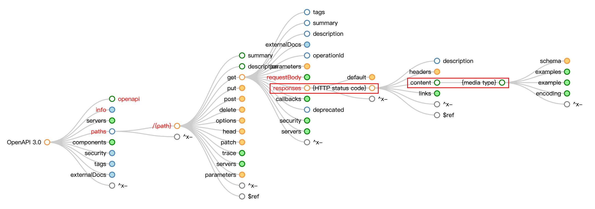

# 响应协议

从 [OpenAPI Map](https://openapi-map.apihandyman.io/?version=3.0) 可以看出，一个 HTTP 接口的响应可以包含多个 status code，每个 status code 的 content 又可以包含多个 Media type。



Stoma 将一个 status code 下的一个 Media type 称为响应协议，用来定义对应 content 的数据类型。

## 示例

以 Swagger Petstore 接口 [getUserByName](https://petstore.swagger.io/#/user/getUserByName) 为例，OpenAPI 协议如下。

```json
{
  "/user/{username}": {
    "get": {
      "summary": "Get user by user name.",
      "description": "Get user detail based on username.",
      "operationId": "getUserByName",
      "responses": {
        "200": {
          "description": "successful operation",
          "content": {
            "application/json": {
              "schema": {
                "$ref": "#/components/schemas/User"
              }
            },
            "application/xml": {
              "schema": {
                "$ref": "#/components/schemas/User"
              }
            }
          }
        },
        "400": {
          "description": "Invalid username supplied"
        },
        "404": {
          "description": "User not found"
        },
        "default": {
          "description": "Unexpected error"
        }
      }
    }
  }
}
```

可以看出：

* `responses` 有多个 status code。
* status code 为 200 时，可能返回两种 Media type，但数据类型都是 `User`。

在 Stoma 中，对应的响应协议如下。

```python
@router.get("/user/{username}")
class GetUserByName(APIRoute):
    """Get user by user name.。

    Get user detail based on username.
    """

    username: str
    """The name that needs to be fetched. Use user1 for testing"""

    @property
    def on_200_application_json(self) -> ResponseSpec[User]:
        return ResponseSpec(
            status_code=200,
            media_type="application/json",
            expected_type=User,
        )

    @property
    def on_200_application_xml(self) -> ResponseSpec[User]:
        return ResponseSpec(
            status_code=200,
            media_type="application/xml",
            expected_type=User,
        )

    @property
    def on_400(self) -> EmptyResponseSpec:
        return EmptyResponseSpec(
            status_code=400,
        )

    @property
    def on_404(self) -> EmptyResponseSpec:
        return EmptyResponseSpec(
            status_code=404,
        )

    @property
    def on_default(self) -> EmptyResponseSpec:
        return EmptyResponseSpec(
            status_code=lambda c: c not in [200, 400, 404],
        )
```

Stoma 以 `@property` 的形式绑定响应协议，名字并没有限制，只要能区分即可。类型有两种，`ResponseSpec` 和 `EmptyResponseSpec`。

## 通用响应协议

`ResponseSpec` 称为通用响应协议，规定了 `status_code`、`media_type` 和 `expected_type`，并且 `ResponseSpec` 是泛型，泛型参数和 `expected_type` 一致。

## 空响应协议

`EmptyResponseSpec` 称为空响应协议，表示响应的 body 是空的，对应 OpenAPI 如下情况：

* status code 无对应 content。
* status code 有对应 content 但是没有定义 Media type。
* 定义了 Media type 但是没有定义 schema。