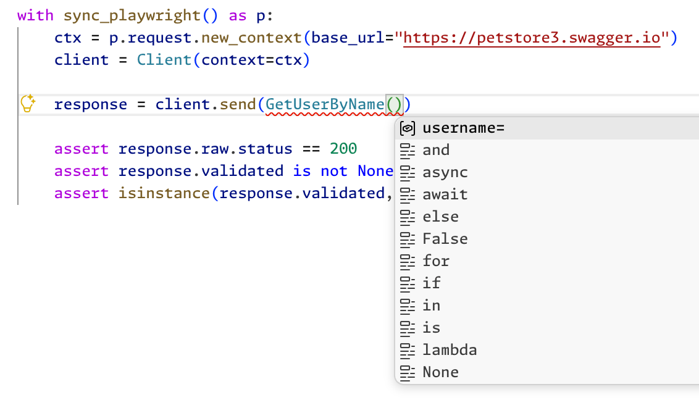
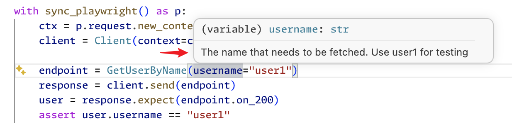
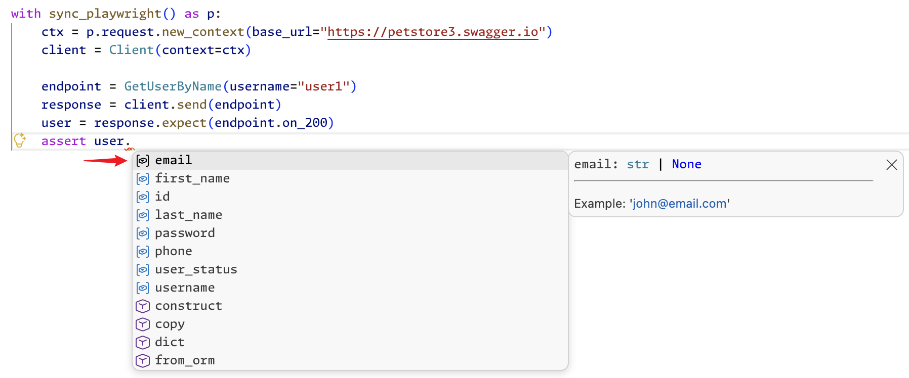

# 快速开始


## 安装

需要使用 Python 3.12 及以上版本。

```bash
# 安装运行时需要的依赖
pip install stoma

# 安装运行时需要的依赖，并增加 CLI 需要的依赖
pip install stoma[cli]
```

## 定义接口

以 Swagger Petstore 接口 [getUserByName](https://petstore.swagger.io/#/user/getUserByName) 为例，说明 Stoma 中如何定义接口。

```python
from typing import Annotated, ClassVar
from pydantic import BaseModel, Field
from stoma import APIRoute, APIRouter, JSONResponseSpec

class User(BaseModel):
    id: Annotated[int | None, Field(examples=[10])] = None
    """Example: 10"""
    username: Annotated[str | None, Field(examples=["theUser"])] = None
    """Example: 'theUser'"""
    first_name: Annotated[str | None, Field(alias="firstName", examples=["John"])] = None
    """Example: 'John'"""
    last_name: Annotated[str | None, Field(alias="lastName", examples=["James"])] = None
    """Example: 'James'"""
    email: Annotated[str | None, Field(examples=["john@email.com"])] = None
    """Example: 'john@email.com'"""
    password: Annotated[str | None, Field(examples=["12345"])] = None
    """Example: '12345'"""
    phone: Annotated[str | None, Field(examples=["12345"])] = None
    """Example: '12345'"""
    user_status: Annotated[int | None, Field(alias="userStatus", examples=[1])] = None
    """
    User Status

    Example: 1
    """

router = APIRouter(prefix="/api/v3")

@router.get("/user/{username}")
class GetUserByName(APIRoute):
    """Get user by user name.。

    Get user detail based on username.
    """

    on_200: ClassVar[JSONResponseSpec] = JSONResponseSpec(200, "application/json", User)

    username: str
    """The name that needs to be fetched. Use user1 for testing"""

```

* `router = APIRouter(prefix="/api/v3")` - 实例化 `APIRouter`，并为所有关联接口设置公共的路径前缀 `/api/v3`。
* `@router.get("/user/{username}")` - 定义接口的请求方法（`GET`）和路径（`/user/{username}`），其中包含一个路径参数 `username`。最终接口路径为 `/api/v3/user/{username}`。
* `class GetUserByName(APIRoute):` - 定义接口，Stoma 中一个接口必须是 `APIRoute` 子类。
    - `APIRoute` 是 pydantic `BaseModel` 子类，定义接口和定义 pydantic 模型是相同的书写方式。
    - 通过 `on_<status_code>: ClassVar[JSONResponseSpec] = JSONResponseSpec(...)` 声明响应协议。当接口响应 Header `Content-Type` 是 JSON（如 `application/json`）时，会使用声明的模型去校验响应体并返回对应实例，示例中 `response.validated` 类型为 `User`。
* `username: str` - Path 参数。如果字段名和路径参数相同，会被识别为 Path 参数。


## 调用接口

```python
from playwright.sync_api import sync_playwright
from stoma import Client

with sync_playwright() as p:
    ctx = p.request.new_context(base_url="https://petstore3.swagger.io")
    client = Client(context=ctx)

    response = client.send(GetUserByName(username="user1"), expect=GetUserByName.on_200)

    assert response.raw.status == 200
    assert response.validated
    assert isinstance(response.validated, User)

```

* Stoma 内部使用 Playwright [APIRequestContext](https://playwright.dev/python/docs/api/class-apirequestcontext) 发送请求并管理 Cookie 等，Playwright 的所有特性均可以正常使用。
* Stoma 将所有接口定义为 pydantic 模型，IDE 可以自动联想所有参数。
    
    还可查看参数的说明。
    
* Stoma 通过 `on_<status_code>` 声明响应协议，实现了 IDE 可以对响应自动联想。
    

## 回顾

以上涵盖了从安装到写出第一个可运行脚本的全流程。Stoma 的核心用法可以归结为三步：

1. 用 `APIRoute` 定义接口，声明参数和响应类型。
2. 用 `APIRouter` 组织路由。
3. 用 `Client` 发送请求。